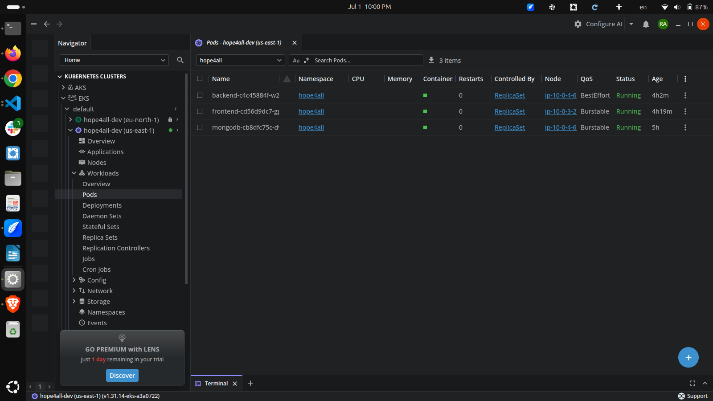
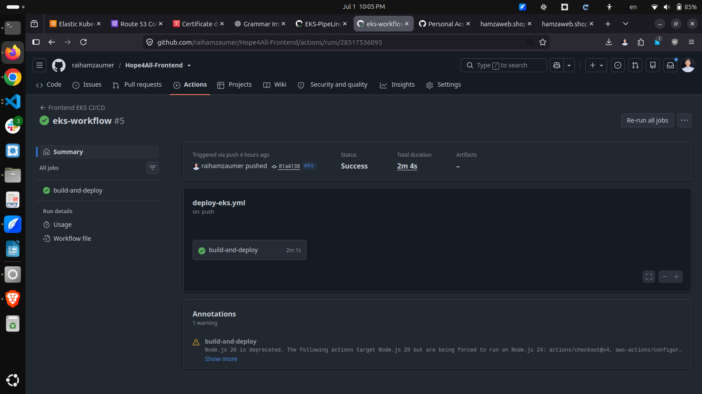
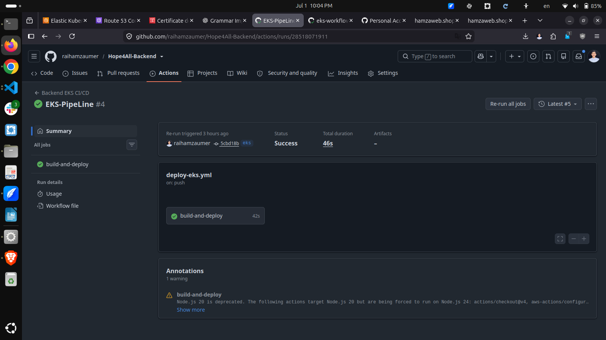
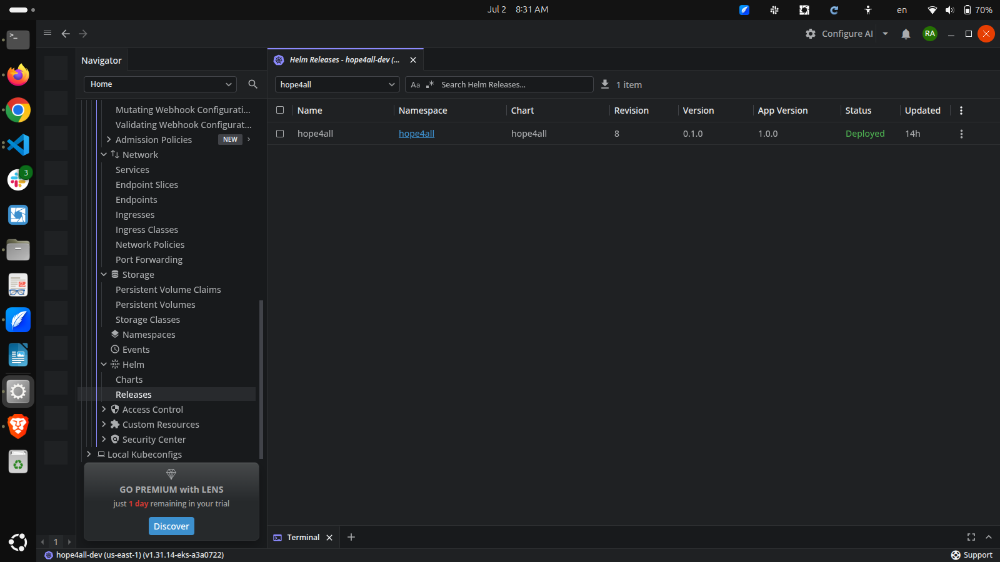
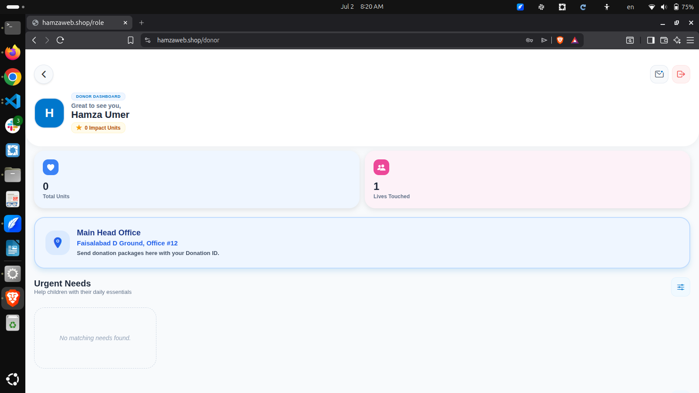
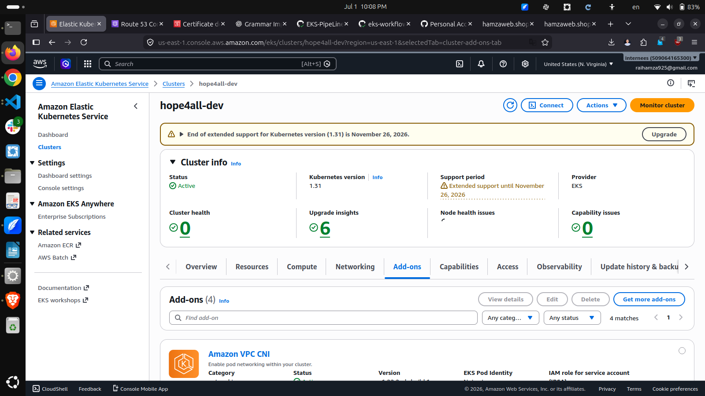
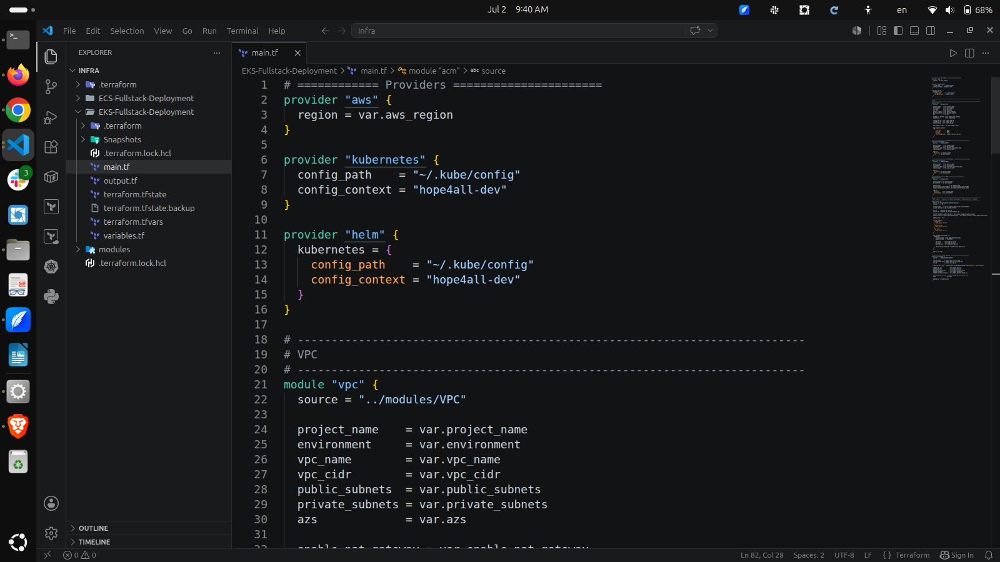
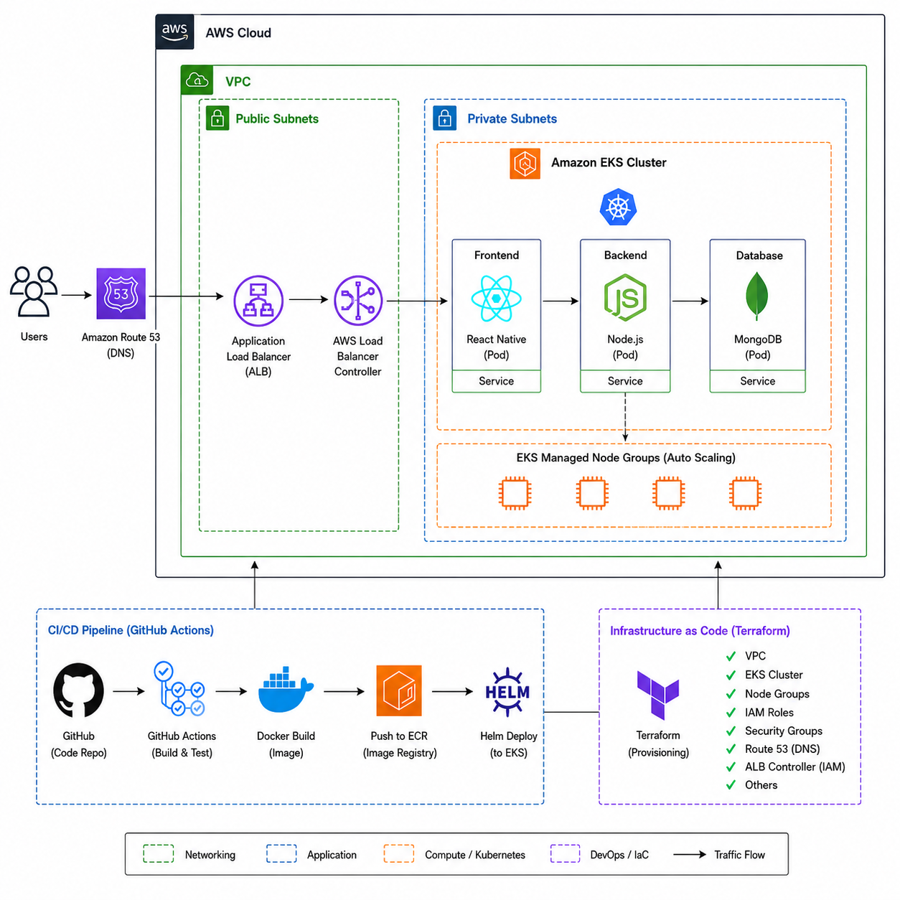

# Hope4All — AWS EKS Deployment 🚀

## 📸 Screenshots

### Kubernetes Pods (Lens)



---

### GitHub Actions - Frontend



---

### GitHub Actions - Backend



---

### Helm Releases



---

### EKS Dashboard



---

### AWS Console



---

### Terraform Resources



---

### Architecture Diagram



> A production-ready three-tier application deployed on Amazon EKS using Terraform, Helm, and GitHub Actions CI/CD pipeline.

---


## 🏗️ Architecture

```
                          ┌─────────────────────────────────────────┐
                          │              AWS Cloud                   │
                          │                                          │
  User ──► Route 53 ──►  │  ACM SSL ──► ALB (Ingress)              │
                          │                  │                       │
                          │         ┌────────┴────────┐             │
                          │         │                 │             │
                          │    /api route        / route            │
                          │         │                 │             │
                          │    ┌────▼────┐      ┌────▼────┐        │
                          │    │ Backend │      │Frontend │        │
                          │    │  Pod    │      │  Pod    │        │
                          │    └────┬────┘      └─────────┘        │
                          │         │                               │
                          │    ┌────▼────┐                         │
                          │    │ MongoDB │                         │
                          │    │  Pod    │                         │
                          │    └────┬────┘                         │
                          │         │                               │
                          │    ┌────▼────┐                         │
                          │    │EBS Vol  │                         │
                          │    │  (PVC)  │                         │
                          │    └─────────┘                         │
                          │                                         │
                          │  ┌─────────────────────────────────┐   │
                          │  │     EKS Managed Node Group       │   │
                          │  │     (t3.medium × 2 nodes)        │   │
                          │  └─────────────────────────────────┘   │
                          └─────────────────────────────────────────┘
```

---

## 🛠️ Tech Stack

| Layer | Technology |
|---|---|
| Cloud Provider | AWS |
| Container Orchestration | Amazon EKS (Kubernetes 1.31) |
| Infrastructure as Code | Terraform |
| Package Manager | Helm |
| CI/CD | GitHub Actions |
| Container Registry | Amazon ECR |
| Frontend | React Native (Expo Web) |
| Backend | Node.js / Express |
| Database | MongoDB |
| Ingress | AWS Load Balancer Controller |
| DNS | Route 53 |
| SSL | AWS Certificate Manager (ACM) |
| Storage | EBS CSI Driver (PVC) |
| Secrets | Kubernetes Secrets |

---

## 📁 Project Structure

```
.
├── Infra/
│   └── EKS-Fullstack-Deployment/
│       ├── main.tf                  # Root module - VPC, EKS, ECR, Secrets
│       ├── variables.tf
│       ├── outputs.tf
│       ├── terraform.tfvars
│       └── modules/
│           ├── VPC/                 # Custom VPC module
│           ├── EKS-Addons/          # EBS CSI, LB Controller, Karpenter
│           ├── ECR/                 # Container registries
│           └── Secrets-Manager/     # AWS Secrets Manager
│
└── helm/
    └── hope4all/                    # Helm chart
        ├── Chart.yaml
        ├── values.yaml
        └── templates/
            ├── secrets.yaml
            ├── frontend-deployment.yaml
            ├── frontend-service.yaml
            ├── backend-deployment.yaml
            ├── backend-service.yaml
            ├── mongodb-statefulset.yaml
            ├── mongodb-service.yaml
            └── ingress.yaml
```

---

## ⚙️ Infrastructure Components

### EKS Cluster
- **Cluster Name:** `hope4all-dev`
- **Region:** `us-east-1`
- **Kubernetes Version:** `1.31`
- **Node Type:** `t3.medium`
- **Node Count:** Min: 2 / Max: 4 / Desired: 2

### EKS Addons
| Addon | Purpose |
|---|---|
| CoreDNS | Internal DNS resolution |
| kube-proxy | Network rules on nodes |
| VPC CNI | Pod networking (real VPC IPs) |
| EBS CSI Driver | Persistent volume provisioning |
| AWS Load Balancer Controller | ALB provisioning from Ingress |

### Networking
- **VPC CIDR:** `10.0.0.0/16`
- **Private Subnets:** Worker nodes (NAT Gateway for internet access)
- **Public Subnets:** ALB / NAT Gateway
- **Availability Zones:** `us-east-1a`, `us-east-1b`

---

## 🚀 Deployment Guide

### Prerequisites

```bash
# Required tools
aws --version        # AWS CLI v2
terraform --version  # Terraform >= 1.5.0
kubectl version      # kubectl
helm version         # Helm >= 3.0
docker --version     # Docker
```

### Step 1: Configure AWS Credentials

```bash
aws configure
# AWS Access Key ID: <your-key>
# AWS Secret Access Key: <your-secret>
# Default region: us-east-1
```

### Step 2: Deploy Infrastructure with Terraform

```bash
cd Infra/EKS-Fullstack-Deployment

# Initialize
terraform init

# Plan
terraform plan -var-file="terraform.tfvars"

# Deploy VPC + EKS first
terraform apply -target=module.vpc -target=module.eks -target=module.ecr_backend -target=module.ecr_frontend

# Update kubeconfig
aws eks update-kubeconfig --name hope4all-dev --region us-east-1

# Deploy addons
terraform apply -target=module.eks_addons

# Deploy remaining resources
terraform apply
```

### Step 3: Grant Cluster Access

```bash
aws eks create-access-entry \
  --cluster-name hope4all-dev \
  --principal-arn arn:aws:iam::<ACCOUNT_ID>:user/<USERNAME> \
  --type STANDARD \
  --region us-east-1

aws eks associate-access-policy \
  --cluster-name hope4all-dev \
  --principal-arn arn:aws:iam::<ACCOUNT_ID>:user/<USERNAME> \
  --policy-arn arn:aws:eks::aws:cluster-access-policy/AmazonEKSClusterAdminPolicy \
  --access-scope type=cluster \
  --region us-east-1
```

### Step 4: Create Kubernetes Secrets

```bash
kubectl create secret generic hope4all-secrets \
  --from-literal=PORT=5001 \
  --from-literal=JWT_SECRET=<your-jwt-secret> \
  --from-literal=MONGO_URI="mongodb://mongodb-service:27017/hope4all" \
  --namespace hope4all \
  --dry-run=client -o yaml | kubectl apply -f -
```

### Step 5: Deploy Application with Helm

```bash
# Install/Upgrade
helm upgrade --install hope4all ./helm/hope4all \
  --namespace hope4all \
  --create-namespace \
  --wait

# Verify
kubectl get pods -n hope4all
```

---

## 🔄 CI/CD Pipeline

### Pipeline Flow

```
Code Push (eks branch)
        │
        ▼
Checkout Code + Helm Chart
        │
        ▼
Configure AWS Credentials
        │
        ▼
Login to ECR
        │
        ▼
Docker Build & Push to ECR
        │
        ▼
Update kubeconfig
        │
        ▼
Helm Upgrade (rolling update)
        │
        ▼
Application Updated ✅
```

### GitHub Secrets Required

| Secret | Description |
|---|---|
| `AWS_ACCESS_KEY_ID` | AWS access key |
| `AWS_SECRET_ACCESS_KEY` | AWS secret key |
| `AWS_REGION` | `us-east-1` |
| `ECR_REGISTRY` | `<account>.dkr.ecr.us-east-1.amazonaws.com` |
| `ECR_REPOSITORY_FRONTEND` | `hope4all-dev-hope4all-frontend` |
| `ECR_REPOSITORY_BACKEND` | `hope4all-dev-hope4all-backend` |
| `CLUSTER_NAME` | `hope4all-dev` |
| `HELM_RELEASE` | `hope4all` |
| `HELM_REPO_TOKEN` | GitHub PAT for Helm chart repo |

### Branch Strategy

| Branch | Trigger | Target |
|---|---|---|
| `main` | ECS deployment workflow | AWS ECS Fargate |
| `eks` | EKS deployment workflow | AWS EKS |

---

## 🌐 Domain & SSL

- **Domain:** `www.hamzaweb.shop`
- **SSL:** ACM Certificate (auto-renew)
- **DNS:** Route 53 CNAME → ALB
- **HTTP → HTTPS:** Auto redirect via Ingress annotation

### Ingress Routing

| Path | Service | Port |
|---|---|---|
| `/` | frontend-service | 80 → 8081 |
| `/api` | backend-service | 80 → 5001 |

---

## 🔍 Useful Commands

```bash
# Check all pods
kubectl get pods -n hope4all

# Check ingress / ALB address
kubectl get ingress -n hope4all

# View pod logs
kubectl logs -n hope4all <pod-name>

# Describe pod (debug)
kubectl describe pod -n hope4all <pod-name>

# Helm release status
helm status hope4all -n hope4all

# Helm history
helm history hope4all -n hope4all

# Rollback
helm rollback hope4all -n hope4all

# Check nodes
kubectl get nodes
```

---

## 📊 Monitoring (Lens)

Install [Lens Desktop](https://k8slens.dev/) and connect your cluster:

```bash
aws eks update-kubeconfig --name hope4all-dev --region us-east-1
```

Lens gives you a visual dashboard for:
- Pod status & logs
- Resource usage (CPU/Memory)
- Helm releases
- Network & storage

---

## 🧹 Cleanup

```bash
# Remove Helm release
helm uninstall hope4all -n hope4all

# Destroy infrastructure
cd Infra/EKS-Fullstack-Deployment
terraform destroy -var-file="terraform.tfvars"
```

> ⚠️ Warning: This will delete all AWS resources including the EKS cluster, VPC, ECR repositories, and all data.

---

## 👨‍💻 Author

**Hamza Umer**
- GitHub: [@hamza-umer](https://github.com/raihamzaumer)
- LinkedIn: [Hamza Umer](https://linkedin.com/in/hamza-aws)

---

## 📄 License

This project is for educational purposes as part of a Final Year Project (FYP).
